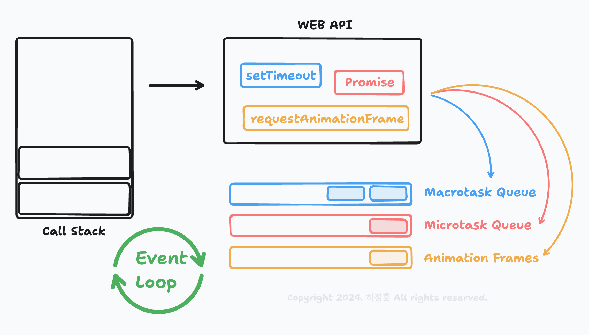

# javascript-event-loop
본 프로젝트는 javascript의 동작과정을 정리하는 시간을 가지기 위한 TIL의 일환입니다.

# Index
- [Thread](#thread)
  - [Thread vs Process](#thread-vs-process)
  - [Why is JavaScript Single Threaded?](#why-is-javascript-single-threaded)
- [Event Loop](#event-loop)
- [Web API](#web-api)
- [Task Queue](#task-queue)
  - [Macrotask Queue](#macrotask-queue)
  - [Microtask Queue](#microtask-queue)
  - [Animation Frames](#animation-frames)
- [requestAnimationFrame vs setTimeout](#requestanimationframe-vs-settimeout)
- [Q&A](#qa)
## Thread
**스레드(Thread)** 는 프로세스(Process) 내에서 실행되는 가장 작은 단위의 작업 흐름입니다. 운영 체제는 프로그램을 실행할 때 프로세스를 생성하며, 이 프로세스 내부에서 여러 스레드가 생성되어 작업을 처리할 수 있습니다. 

### Thread vs Process
| **특성**              | **프로세스(Process)**                        | **스레드(Thread)**                  |
|-----------------------|----------------------------------------------|-------------------------------------|
| **정의**              | 실행 중인 프로그램                         | 프로세스 내에서 실행되는 작업 단위 |
| **메모리 공유**       | 독립적인 메모리 공간을 가짐                | 프로세스의 메모리를 공유           |
| **실행 단위**         | 더 큰 실행 단위                           | 더 작은 실행 단위                  |
| **생성 비용**         | 상대적으로 크다                           | 상대적으로 적다                    |
| **독립성**            | 다른 프로세스와 독립적                    | 같은 프로세스 내 다른 스레드와 의존적 |
| **오버헤드**          | 프로세스 간 통신(IPC)이 필요, 느림         | 스레드 간 통신이 빠름              |
> 더 자세한 내용은 추후에 스레드와 프로세스에 대해 정리할때 다루겠습니다.

### Why is JavaScript Single Threaded?
1. **초창기 웹 환경의 제한**  
   1. 자바스크립트의 초기 목적
      - 자바스크립트는 1995년 브렌던 아이크(Brendan Eich)에 의해 Netscape Navigator 브라우저에서 실행되는 간단한 사용자 인터페이스 조작과 폼 검증을 위해 설계되었습니다.
      - 초기 웹 환경에서는 복잡한 애플리케이션보다 정적 페이지에 간단한 상호작용을 추가하는 것이 주된 요구사항이었습니다.
      - 이러한 단순한 작업에는 멀티스레드가 필요하지 않았습니다.
   2. 당시 하드웨어 및 성능 제약
      - 1990년대 중반의 대부분의 가정용 컴퓨터는 단일 CPU 코어를 사용했습니다.
      - 멀티스레드 프로그래밍은 당시 기술적으로 가능했지만, 추가적인 복잡성을 야기할 뿐 아니라 성능상의 이점이 크지 않았습니다.
--------------------
2. **싱글 스레드로 인한 브라우저 아키텍처 단순화**  
   1. DOM 조작과 안전성 보장
      - 자바스크립트는 HTML 문서의 DOM(Document Object Model)과 CSSOM(CSS Object Model)을 조작합니다.
      - DOM과 CSSOM은 비동기적으로 여러 스레드에서 조작될 경우 데이터 충돌과 상태 불일치 문제가 발생할 수 있습니다.  
        - ex. 한 스레드가 DOM 노드를 삭제하려는 중에, 다른 스레드가 동일한 DOM 노드를 수정하려고 하면 충돌이 발생.  
      - 싱글 스레드는 이러한 동기화 문제를 원천적으로 방지하여 브라우저와 개발자 모두에게 안정성과 단순함을 제공합니다.
   2. 스레드 간 통신의 비용
      - 멀티스레드 환경에서는 각 스레드 간 통신(예: 메시지 전달, 상태 공유)을 처리하기 위한 추가적인 오버헤드가 발생합니다.
      - 싱글 스레드 모델은 이러한 복잡성을 제거하고 더 빠르고 일관된 개발 환경을 제공합니다.
--------------------
3. **개발자 경험(Developer Experience)의 최적화**  
   1. 비동기 프로그래밍 모델의 도입
      - 자바스크립트는 싱글 스레드이지만, 비동기 작업을 효율적으로 처리하기 위해 이벤트 루프(Event Loop)를 채택했습니다.
      - 이벤트 루프를 통해 자바스크립트는 IO 작업(예: 네트워크 요청, 파일 읽기)을 비차단 방식으로 처리하며, 사용자 인터페이스가 멈추지 않게 유지합니다.
        - 이는 멀티스레드와 비슷한 경험을 제공하면서도 프로그래밍의 복잡성을 줄이는 효과를 가져왔습니다.
   2. 초보 개발자 친화적
      - 멀티스레드 프로그래밍은 데이터 경합, 데드락, 스레드 안전성 등의 문제가 발생할 수 있어 초보 개발자에게는 어려운 영역입니다.
      - 자바스크립트는 초보 개발자도 쉽게 사용할 수 있는 언어로 설계되었으며, 싱글 스레드는 이러한 목표에 부합했습니다.
--------------------
4. **현재 자바스크립트에서 멀티스레드 지원**  
   현대 웹 환경에서는 멀티스레드가 필요할 수 있는 복잡한 애플리케이션이 등장했습니다. 이를 해결하기 위해 자바스크립트는 Web Workers와 같은 기술을 도입했습니다.  
   - Web Workers를 통해 멀티스레드 작업이 가능하지만, DOM 접근이 불가능하며, 메인 스레드와는 독립된 환경에서 동작합니다.
   - 이러한 접근 방식은 싱글 스레드의 안정성을 유지하면서도 멀티스레드의 성능을 활용할 수 있게 합니다.

## Event Loop
> **이벤트 루프(Event Loop)** 는 JavaScript의 비동기 작업을 처리하는 메커니즘입니다.   
> JavaScript는 싱글 스레드로 동작하지만, 이벤트 루프를 통해 비동기 작업을 효과적으로 관리하여 논블로킹(non-blocking) 동작을 지원합니다.  



### 이벤트 루프의 기본 개념
1. 싱글 스레드:  
JavaScript는 단일 콜 스택(Call Stack)을 사용하여 동작하며, 한 번에 하나의 작업만 처리할 수 있습니다.

2. 비동기 처리 필요성:  
타이머, 네트워크 요청, DOM 이벤트와 같은 작업은 즉시 완료되지 않기 때문에 별도의 비동기 처리 방식이 필요합니다.

3. 이벤트 루프 역할:  
이벤트 루프는 **메인 스레드(Call Stack)** 와 **태스크 큐(Task Queue)** 를 관리하여 비동기 작업의 콜백을 적절한 시점에 실행합니다.

## Web API

> **Web API**는 브라우저에서 제공하는 비동기적 기능을 제공하는 API들을 의미합니다.  
> 자바스크립트는 싱글 스레드로 동작하기 때문에, 시간 지연이 있는 작업이나, 네트워크 요청 등과 같은 비동기 작업을 효율적으로 처리하기 위해 Web API가 필요합니다.  
> Web API는 브라우저의 JavaScript 엔진과는 별도로 존재하는 "백그라운드 스레드"에서 실행됩니다.

브라우저에서 제공하는 Web API의 예시는 다음과 같습니다:
- `setTimeout`, `setInterval`: 일정 시간 후에 콜백 함수를 실행하는 타이머 관련 함수.
- `fetch`, `XMLHttpRequest`: 네트워크 요청을 처리하는 API.
- `WebSocket`: 서버와 실시간 통신을 위한 API.
- `requestAnimationFrame`: 애니메이션 렌더링을 위한 함수.
- `MutationObserver`: DOM 변화 관찰 API.

이러한 Web API들은 자바스크립트 엔진 외부에서 비동기 작업을 처리하며, 콜백 함수나 프로미스 등을 통해 자바스크립트 코드가 해당 작업이 완료된 후 결과를 처리할 수 있게 해줍니다.

### `setTimeout`의 동작 과정

`setTimeout` 함수는 Web API의 대표적인 예시입니다. 이 코드는 일정 시간이 지난 후에 지정된 콜백 함수를 실행합니다.  
아래는 `setTimeout`이 어떻게 동작하는지 상세히 설명한 과정입니다.

#### 1. **setTimeout 호출**:
```javascript
setTimeout(() => { console.log('Hello, Web API'); }, 3000);
```
- JavaScript 엔진이 setTimeout 함수를 만나 실행하며 Web API 환경으로 타이머와 콜백함수를 전달합니다.

#### 2. Web API에서 타이머 시작
- `setTimeout`의 3000ms 타이머는 Web API(브라우저의 백그라운드 스레드)에서 시작됩니다. 타이머가 동작하는 동안 자바스크립트 엔진은 계속해서 다른 코드를 실행할 수 있습니다.
- 타이머가 3000ms 동안 작동하고 있을 때, 자바스크립트 엔진은 그 시간 동안 다른 작업들을 처리할 수 있습니다.
  
#### 3. 타이머 완료 후 매크로 태스크 큐에 콜백 함수 등록
- 지정된 타이머가 완료되면 해당 콜백 함수를 **매크로 태스크 큐(Macrotask Queue)** 로 이동시킵니다. 이때 **콜백 함수**는 실행 준비가 된 상태로 대기합니다.

#### 4. 이벤트 루프의 동작
- 자바스크립트는 **이벤트 루프(Event Loop)** 를 통해 비동기 작업을 처리합니다.
- 이벤트 루프는 콜스택이 비어있는지 계속해서 확인하고 있습니다. 만약 콜스택이 비어 있으면, 태스크 큐에 있는 대기 중인 작업을 콜스택으로 밀어 넣어 실행합니다.
  - ***단, 매크로 태스크 큐(Macrotask Queue), 마이크로 태스크 큐(Microtask Queue), 애니메이션 프레임 큐(Animation Frames Queue) 간의 우선순위에 따라 콜스택에 들어가게 됩니다.***

#### 5. 콜백 함수 실행
- 이벤트 루프를 통해 태스크 큐에서 콜스택으로 들어온 콜백 함수가 실행됩니다.
- 콜백함수: () => { console.log('Hello, Web API'); }

## Task Queue
- 일반적인 순서 `Microtask` > `Animation` > `Macrotask`
### Macrotask Queue
> ***이벤트 루프(Event Loop)의 우선순위가 가장 낮습니다.***  
> 태스크 큐 중 하나로, 매크로 태스크 큐에 들어가는 작업은 대개 시간이 상대적으로 긴 작업이나 비동기적으로 실행되는 이벤트 처리 코드입니다.  
  
#### Macrotask Queue에 포함되는 주요 작업  
- `Run Script`
- `setTimeout`, `setInterval`
- `XMLHttpRequest`
- `Event callbacks`

### Microtask Queue
> ***이벤트 루프(Event Loop)의 우선순위가 가장 높습니다.***  
> 마이크로 태스크는 실행 우선순위가 높은 작업으로, 일반적으로 빠르게 처리해야 하는 비동기 작업에 사용됩니다.
>> 이벤트 루프는 콜 스택이 비워지면 마이크로 태스크 큐를 먼저 확인하여 모든 마이크로 태스크를 처리한 이후에 다음단계를 진행합니다.

#### Microtask Queue에 포함되는 주요 작업
- `Promise`
- `async / await`
- `queueMicrotask`
- `MutationObserver` 

### Animation Frames
> ***이벤트 루프(Event Loop)의 우선순위는 일반적으로 Microtask Queue와 MacroTask Queue의 중간입니다.***  
> 마이크로 태스크가 완료된 후, 렌더링 직전 단계에서 실행됩니다.
>> But, Animation Frames과 MacroTask Queue의 실행 순서는 현재 이벤트 루프의 상황과 렌더링 타이밍에 따라 달라질 수 있습니다.

#### Animation Frames에 포함되는 주요 작업
- `requestAnimationFrame`

#### 실행 순서 변경 가능성
- **시나리오 1: 렌더링이 지연되지 않는 경우**  
  - 렌더링 타이밍이 정상적으로 진행되면, 애니메이션 프레임(Animation Frames)이 매크로 태스크(Macrotask)보다 먼저 실행됩니다.
- **시나리오 2: 렌더링이 지연되는 경우**
  - 태스크 큐에 작업이 너무 많아 렌더링이 지연되면, 렌더링 타이밍이 지나치게 늦어지고 이로 인해 매크로 태스크가 먼저 실행될 수도 있습니다.
  - 예를 들어, 렌더링 사이클이 놓쳐졌을 때 setTimeout이 먼저 실행되고 이후 requestAnimationFrame이 실행될 수 있습니다.

#### 실행 순서에 따른 예제
```javascript
console.log('1: Start'); // Run Script (매크로 태스크)

setTimeout(() => {
    console.log('2: setTimeout'); // 매크로 태스크
}, 0);

Promise.resolve().then(() => {
    console.log('3: Promise.then'); // 마이크로 태스크
});

requestAnimationFrame(() => {
    console.log('4: requestAnimationFrame'); // 애니메이션 프레임 큐
});

console.log('5: End'); // Run Script (매크로 태스크)
```
- **일반적인 결과:**
```text
1: Start
5: End
3: Promise.then
4: requestAnimationFrame
2: setTimeout
```
- **렌더링 지연 시:**
```text
1: Start
5: End
3: Promise.then
2: setTimeout
4: requestAnimationFrame
```

## requestAnimationFrame vs setTimeout
> `requestAnimationFrame`과 `setTimeout`은 모두 브라우저에서 비동기적으로 코드를 실행하기 위한 타이머 API이지만, 주요 용도와 작동 방식에 차이가 있습니다.

### 기본 개념
| **특성**                 | **requestAnimationFrame (rAF)**                          | **setTimeout**                         |
|--------------------------|---------------------------------------------------------|----------------------------------------|
| **주 목적**              | 브라우저의 **애니메이션 작업** 최적화                     | 특정 시간 후에 코드를 실행                |
| **작동 방식**            | 브라우저의 **리페인트 주기(보통 16.66ms)**와 동기화        | 지정된 지연 시간(밀리초 단위)에 실행       |
| **주기**                 | 프레임마다 호출 (일반적으로 초당 60fps)                  | 설정한 지연 시간에 따라 호출              |

### 타이밍의 정밀도
- **`requestAnimationFrame`**: 브라우저의 **리페인트 주기**와 동기화되어 작동합니다.
    - 브라우저의 화면 새로고침 빈도(일반적으로 60Hz 또는 120Hz 등)에 따라 호출되므로 **정밀하고 부드러운 애니메이션**이 가능합니다.
    - 초당 60프레임 기준으로 약 **16.66ms** 간격으로 호출됩니다.
    - 예시:
      ```javascript
      function animate() {
        console.log('Frame updated');
        requestAnimationFrame(animate);
      }
      requestAnimationFrame(animate);
      ```
- **`setTimeout`**: 설정된 지연 시간 이후에 코드를 실행합니다.
    - 지정된 시간이 경과한 후 콜백을 실행하도록 예약하지만, 정확히 해당 시간에 실행되는 것을 보장하지 못합니다.
    - 최소 지연 시간은 4ms 이상(`setTimeout(fn, 0)`도 4ms 지연).
    - 예시:
      ```javascript
      console.log('Start');

      setTimeout(() => console.log('Timeout'), 1000);
      
      const now = Date.now();
      while (Date.now() - now < 1500) {} // 1.5초 동안 차단
      
      console.log('End');
      ```
      결과:
      ```text
      Start
      End
      Timeout
      ```

### 성능 및 부드러운 애니메이션 처리
| **특성**                           | **requestAnimationFrame (rAF)**                                  | **setTimeout**                                   |
|------------------------------------|------------------------------------------------------------------|------------------------------------------------|
| **프레임 동기화**                  | 브라우저의 화면 리프레시 주기(60Hz)와 동기화                      | 특정 시간 간격으로 실행 (프레임 동기화 아님)        |
| **CPU와 GPU 리소스 최적화**        | 브라우저가 최적화 작업(예: 애니메이션이 보이지 않으면 중단) 수행  | 항상 설정된 시간 후에 호출되므로 최적화 부족        |
| **부드러운 애니메이션 지원**       | 가능 (화면 주기에 맞춰 호출)                                     | 불가능 (프레임 간격이 일정하지 않아 끊길 수 있음)  |

### 백그라운드 동작
- **`requestAnimationFrame`**:
    - 브라우저가 **비활성화 상태**(예: 다른 탭으로 이동)일 경우 애니메이션 호출을 중단하여 리소스를 절약합니다.
    - 애니메이션이 활성 탭에서만 실행되므로 불필요한 CPU 사용을 줄입니다.

- **`setTimeout`**:
    - 비활성화 상태에서도 계속 실행됩니다(브라우저에 따라 제한이 있을 수 있음).
    - 불필요한 리소스 사용으로 이어질 가능성이 있습니다.


## Q&A
1. **왜 매크로 태스크 큐가 최우선이 아닌가?**  
   1. `Run Script`는 특별한 초기 작업  
      - `Run Script`는 자바스크립트 코드를 실행하는 특별한 초기 매크로 태스크로, 이벤트 루프가 시작될 때 처리됩니다.
      - 이후 이벤트 루프는 마이크로 태스크 큐와 매크로 태스크 큐를 순환하며 실행합니다.
   2. 이벤트 루프는 **현재 실행 중인 태스크**를 끝낸 후 마이크로 태스크 큐를 먼저 비웁니다.  
      - 마이크로 태스크 큐가 비워진 다음에야 매크로 태스크 큐의 다음 태스크로 이동합니다.
      - 따라서 `Run Script`가 실행된 이후, 마이크로 태스크 큐가 매크로 태스크 큐보다 우선 실행됩니다.  
2. **requestAnimationFrame은 프레임을 100% 보장해주나?**  
   1. `requestAnimationFrame`은 브라우저 리페인트 주기와 동기화하여 최적화된 애니메이션을 제공하지만, **프레임을 100% 보장하지는 않습니다.** 
   2. 렌더링 단계는 이벤트 루프의 논리적 순서에는 포함되지만, 필수적인 작업은 아닙니다.  
   3. 이로 인해 `requestAnimationFrame`이 실행되지 않거나, `setTimeout`이 더 빨리 실행되는 상황이 발생할 수 있습니다.